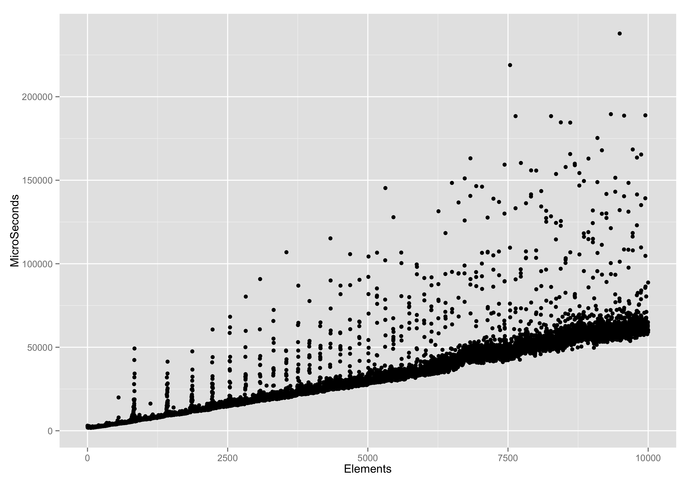
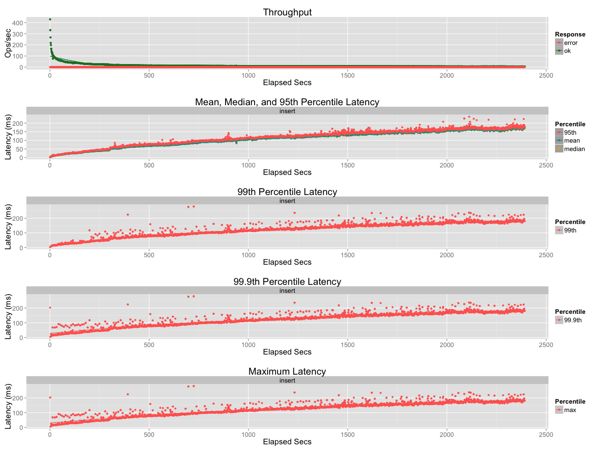

bigset: A Riak Core Application
======================================

# What?
A prototype / PoC delta orswot database built on riak-core

# Why?  Inserting an element into a set in riak's data types
Implementation involves reading the whole set off disk, deserialising
it, appending the new element, reserialising, and writing, then
replicating to N-1 replicas. If you were unlucky any or all of the
replicas updated that set concurrently, so at each replica you must
read the whole set, merge the incomng and local sets, serialise, and
write to disk. That dance means sets are not very scalable on riak.

Here is a graph of inserting just 10k elements into riak:

Here is one of basho_bench trying to load 100k elements into a single set:

I had to kill the run before my machine melted.

## Really WHY?

Serious? OK: because adding and element to a set should not take time
proportional to the size of the set. We're looking for something
better than `O(n)`. If we can add elements effeciently, and look them
up efficiently, maybe we can have sets that are pretty large. Like
100s of 1000s, or even millions of elements.

# How?

See the doc (doc/design.md) for details. The overview is:

don't store everything in one key. Use a logical clock that we read
per write to generate dots, and then append the new elements and dots
to the set. Take advantage of Level for this.

# When?

I'm working on it. Current sticking points

* reads are really slow as they are a fold of N keys
* batch inserts are slow as they generate N writes

Pretty sure you can check JIRA for the plan and progress.

