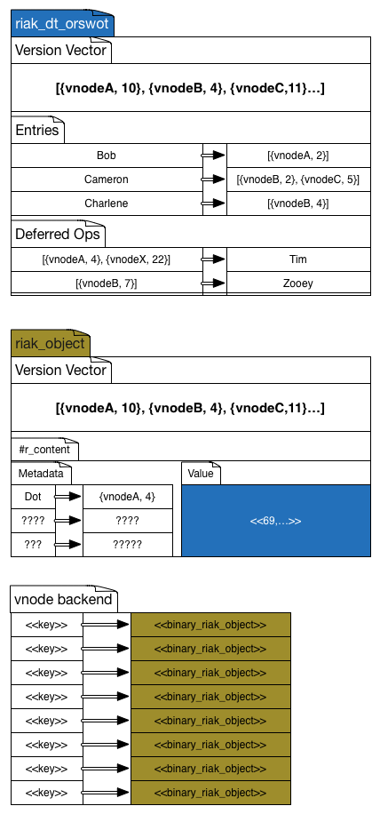
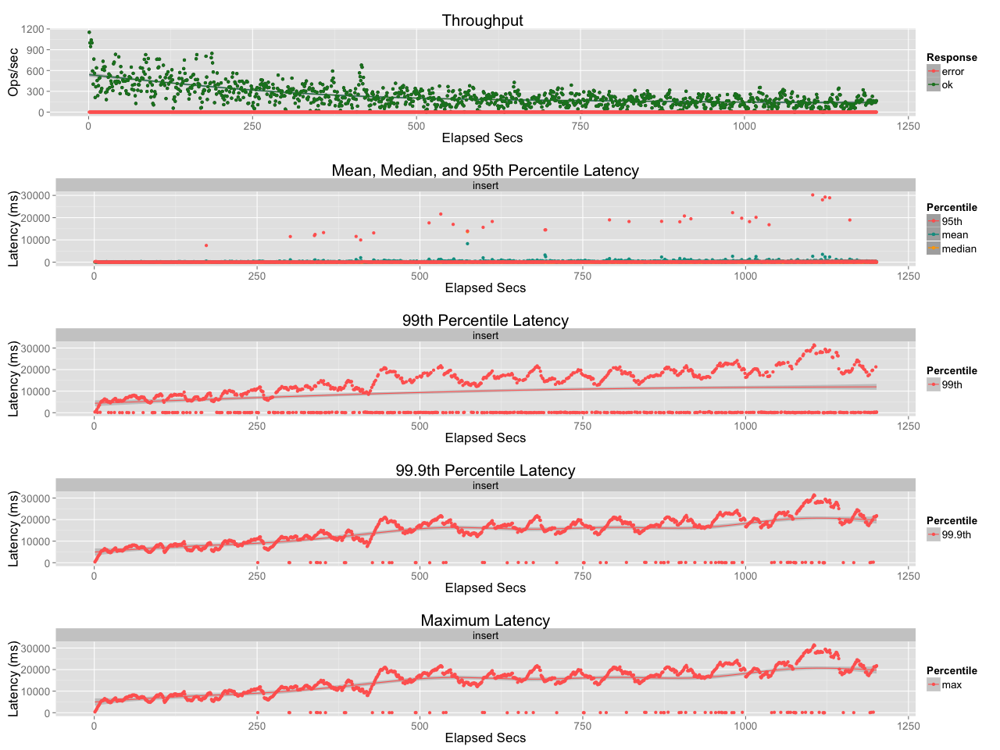
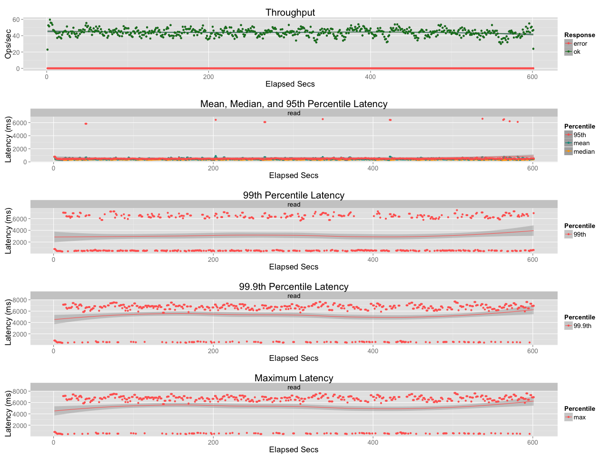
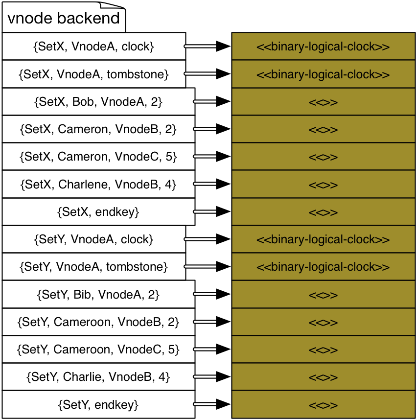

# Bigset

## 1. Why?

Set CRDTs stored in riak are just `riak_dt_orswot`s, binary encoded,
and stuffed in a `riak_object`. As a result they have a size limit of
1MB (as do all `riak_object`s.)

Another side effect of the design is that inserts/removes of an
element to a set takes O(n) time. Using the correct backing data
structure one would intuitively expect inserts to be O(1), and they
are, _if_ you have a `riak_dt_orswot` in memory. But riak is a
database that persists data to disk and riak is a
distributed/replicated database that replicates data over a network.

### 2. Sets in Riak 2+

In riak 2+ the CRDT set is stored as a binary, inside a
`riak_object`. We took this decision so that a CRDT could be
replicated like a normal `riak_object`, AAE'd like a normal
`riak_object`, read repaired like a normal `riak_object`, and MDC'd
like a normal `riak_object`. In short, we wanted to do as little as
possible in terms of "teaching Riak" about CRDTs.

CRDTs in Riak 2+ are plumbed into riak in just a few places: an API
for the client libraries, an option that is passed through
`riak_kv_put_fsm`, a couple of lines in `riak_kv_vnode`, and a couple
of lines in `riak_object`'s `merge` logic. The bulk of the non-API
code is in `riak_kv_crdt`.

Throughout most of Riak a CRDT is just an opaque binary in the value
portion of a `riak_object`. This means a CRDT like a Set has two
version vectors! The one in `riak_object`, and the one in the Set
itself.

#### 2.1. Writes

When adding to a set in riak today the client sends an *Operation* to
Riak, something like:

    add 'X' to Set 'Y'

At the API boundary this is parsed, validated, and stuck into a record
(`crdt_op`) that contains fields for the module (`riak_dt_orswot`),
the op (`{add, 'X'}`) and a context (not used for adds, see below on
[Consistency](#consistency) as I believe this is a bug.)

A call to `riak_kv_crdt:new/3` returns an object that has an
empty/bottom value `riak_dt_orswot` for merging with whatever maybe
stored in Riak, and the operation is then applied inside the
vnode. The FSM does what it does for a regular PUT, and passes on the
`#crdt_op{}` record from the `Options` list to the coordinating vnode.

In the coordinating vnode, Riak does the following:

* Read the local value
* Treat incoming object as a sibling (it has no vclock, so it is a
  sibling by riak's vnode vclock rules)
* Deserialise the CRDT on disk
* Merge the incoming bottom with the present CRDT (if there is one)
* Apply the operation to the result
* Serialize the new value in a `riak_object`
* Write object to disk
* Return object to the FSM for replicating

This may all seem a little wasteful. In actual fact it is even worse,
as the merge causes the CRDT to be de-serialized, and re-serialized,
and then it is de-serialized again for the operation application, and
finally serialized for storage/replication. This was a bug/mistake and
can be addressed. However O(4n) is still O(n).

The Put FSM will then send the new value to N-1 replicas. At each
replica the following occurs:

* Read the local value
* If the incoming object's version vector descends the local:
    * Write the new value to disk
* If the local descends the incoming
    * discard incoming value
* If they are concurrent
    * run `riak_object:merge/2` which in turn calls `riak_kv_crdt:merge/2` which will
        * De-serialize the local value
        * Deserialise the incoming value
        * run `riak_dt_orswot:merge/2` on the two values
    * finally serialize the result, and store on disk

There may be many things we can do to optimize this: have a single
format for in-memory and on disk/wire that does not require
serialization seems the first step, but there is still the cost of
reading a potentially large object off disk simply to add a single
element. We replicate that whole object (see [Deltas](#deltas) below
if you're screaming "Deltas! Deltas!" right now.) However, even if we
optimize the current implementation, there is still that `riak_object`
size limit of ~1MB.

")

Above is a plot generated by running a single riak node, a single
client, in a tight loop, adding ten thousand random words from my
mac's dictionary file to a single CRDT set.

Below is a basho_bench run adding one hundred thousand random elements
to one thousand sets, with 50 concurrent clients. Run on a cluster of
4 machines in the Basho Boston colo.

Although the plot below might show the trend more clearly, thanks to
the shorter run time and less extreme outliers

#### 2.2. Reads

Reading a CRDT Set is just like reading a regular
`riak_object`. Though if the `riak_object` version vectors indicate
divergence, `riak_object:reconcile/1` is called which causes each
sibling to be de-serialized, merged, and the final result to be
serialized again. A bit of a waste as the API boundary simply takes
care of deserialising the result, and calling
`riak_dt_orswot:value/1`. There is some protocol buffers/json
encoding, too. I can't imagine a way that reading a set of size `n`
was not an O(n) operation, can you?

The above plot shows read operations after the previous write
benchmark was run. 20 workers, 10 minutes, pareto distribution over
the one thousand sets, reading the full set. I don't think that is too
bad considering each set has 100k elements, though it could certainly
be improved.

#### 2.3. Queries

There are none. If you want to ask questions of your set (cardinality,
is 'X' a member, 100 lowest members etc) you have to read it, and
query it in your application. This seems wasteful if you just want the
first 100 members, or to know if 'X' is in the Set, and gets more
wasteful the larger the Set is.

### 3. What About Deltas?

In
[Efficient State-based CRDTs by Delta-Mutation](http://arxiv.org/abs/1410.2803)
Almeida et al describe a technique for avoiding the cost of full state
replication. An operation on a CRDT generates a Delta, that can be
understood as a fragment of a CRDT. This delta can be replicated and
merged, and expresses just the change of the original operation. The
delta merge has the same properties of a full state merge: Idempotent,
commutative, associative. This means it can be delivered over
unreliable networks (AKA networks.)

This seems ideal for at least part of the issues outlined
above. However merely replacing the `riak_dt_orswot` in riak with a
`riak_dt_delta_orswot` is not enough. In fact, we tried, and it was
worse.

#### 3.1. Accidental Optimization

Recall the steps at the replica above for Set writes:

* Read the local value
* If the incoming object's version vector descends the local:
    * Write the new value to disk

With a delta this can never happen. That means, for a replicated delta
operation the action at the replica must always be:

* run `riak_object:merge/2` which in turn calls `riak_kv_crdt:merge/2` which will
    * De-serialize the local value
    * deserialise the incoming value
    * run `riak_dt_orswot:merge/2` on the two values
* finally serialize the result, and store on disk

Even when there is no concurrency the price must be paid of
deserialisation, merge, and reserialise. The only time an incoming
delta can ever replace what is on disk at a replica is when it is the
first received update. In the best case, the savings are only in the
size of the data sent over the network. The full read and update at
the coordinator is as above, as is the read and merge at the
replica. Sadly the plots are misplaced, but our experiments with this
showed deltas to perform mostly worse than full state replication in
riak.

### 4. Summary

In summary, the answer to "why bigsets?" is that a set per-object is
inefficient and restrictive.

## 5. What is Bigset?

Bigset is the temporary name for a prototype/proof of concept
idea. The aim is to engineer a system that takes advantage of the
delta-CRDT work cited above. The fundamental difference is that rather
than a set per-object, instead the Set is decomposed into multiple
keys. At least one key per element, and extra keys for metadata.

## 6. Design Overview

So far bigset is not in riak, but is a riak_core project. You can find
it in [here](https://github.com/basho-bin/bigsets "Bigsets -
basho-bin"). I won't cover the riak-core-ness of the design, I'll assume
you know about rings, replicas and vnodes.

What follows is how the prototype works today, and what I imagine
would be the next steps, but I've been wrong before.

In a (misleading) sentence bigsets is an append only log of deltas
that trades space for time, it favours writes over reads.

### 6.1. The backend

Bigsets requires a sorted backend, it uses leveldb, maybe other
backends are also suitable.

Logically at least, the biggest change is the backend storage of the
set. In riak one key maps to one value, in bigsets, we split a set
over multiple keys. See [Key Scheme](#key-scheme) for more details
about the logical on disk format. We trust the sorted property of
leveldb to ensure that each set is grouped together contiguously, and
the logical clock is the first key in each set.

### 6.2. Hashing

In Riak a Bucket and Key pair are hashed to decide the preflist and
nodes that will store the data, in bigsets only the Set name is
hashed. This means that all the elements of a particular Set 'S' share
the same preference list, and are stored therefore in the same
locations. Does this mean we can model buckets as sets, and
riak_objects as elements and get something like the global logical
clocks work? Maybe.

### 6.3. Key Scheme

The bulk of how bigset works is down to the way keys are named and
stored. Based on the observation that we can't store more than 1MB max
in a riak object, and that reading, deserialising, inserting,
reserialising, and writing is wasteful if all we want to do is add an
integer to a set of 1million integers, the key scheme attempts to read
as little information as possible before insert/remove.

#### 6.3.1. Clock Keys

The clock key(s) are the first keys in the Set. There are multiple
clock keys: one per actor. Each actor only reads and writes it own
clock key. An actor stores another actor's clock keys to simplify
interaction with hand off and AAE. The clock Key is a binary that is
made up of the set name, the special key designation character `c`
(for clock) and the actor name.

    <<SetNameLength:32/little-unsigned-integer,
      SetName:SetNameLength/binary,
      $c:1/binary,
      ActorName/binary>>

#### 6.3.2 Set Tombstone

How or why this key exists is covered in [Hand Off](#handoff) and
[Compaction](#compaction) below. Its purpose is to store a
`bigset_clock` that describes all the events a vnode may have on disk,
that it should remove. It has a part to play in
[compaction](#compaction) and also in [reads](#read). It is a way to
do whole set deletes. It is very much like the clock key. Each actor
has their own, and only uses their own, and only reads and writes
their own. It is a binary that is made up of the set name, the special
key designation character `d` (for `c` < `d` < `e`) and the actor
name.

    <<SetNameLength:32/little-unsigned-integer,
      SetName:SetNameLength/binary,
      $d:1/binary,
      ActorName/binary>>

Eventually (in the "eventual consistency" sense of the word) this key
is empty/does not exist. After a compaction "consumes" this tombstone
it is discarded (unless a new one, from a hand off, is created in the
mean time. You see "eventually".)

#### 6.3.2. Element Keys

An element or member of the set is a client provided opaque
binary. When an element is added to the set or removed from the set, a
key is written. This means there maybe more keys in the set than
elements. This also means that there are temporary tombstones in the
set, we'll look at this more later.

An element key is a binary made up of the Set name, a special key
designation character `e` that means `element key`, the element, the
actor that coordinated the insert/remove, the actor's event counter
for the insert/remove event which together make a _dot_ for the
insert, (and yes, we increment the clock for removes), and a special
tombstone designation character `a` or `r` that denotes if the
operation is an add or a remove.

    <<SetNameLength:32/little-unsigned-integer,
      SetName:SetNameLength/binary,
      $e:1/binary,
      ElementLen:32/little-unsigned-integer,
      Element:ElementLen/binary,
      ActorLen:32/little-unsigned-integer,
      Actor:ActorLen/binary,
      Counter:64/little-unsigned-integer,
      $a | $r:1/binary>>

The comparator sorts so that keys for the same element are together
and sorted by actor, then event, and finally adds `a` before removes
`r`. That last is a carry over from before the clock was incremented
for removes.

#### 6.3.3. End Key

The end key is a key that sorts highest of all. It is used for
streaming-fold's end key, and to signify the end of the set. It is made
up of the Set name and the special key designation character `z`.

    <<SetNameLen:32/little-unsigned-integer,
      SetName:SetNameLen/binary,
      $z>>

#### 6.3.4. Comparator

The comparator sorts the keys so that clock keys come first, then the
set tombstone keys, then the element keys. Finally the end-key sorts
last. The code is in C++ (my first ever!) and can be found in the
leveldb repo. It should not be there.

### 6.4. Payload

We've seen the keys, what are their values?

#### 6.4.1. Clock Value

The clock is coded in the `bigset_clock` module. It's a Version
Vector, and a set of non-contiguous dots. Any actor `A` will always
have only contiguous events for it's own clock. There's a section on
the clock [below](#bigset-clock).

#### 6.4.2. Element Value

Each element key has a payload of a full `bigset_clock` as a context
of the operation the key expresses. Yes, that seems "kinda large", I'm
not sure what to do about it right now. However, it's no different to
a `riak_object` having it's own version vector. It's a consequence of
Riak's "action-at-a-distance" model. It doesn't matter about the order
of operations as the vnodes see it, what matters is how the clients
see events. I'll cover all the "why" later, for now, just sigh and
accept it. Hopefully we can find an efficient way to encode the
context-clock-as-value. See also [compaction](#compaction).

It is possible that instead of the full context we could return a
per-element context at read time, and only store that. We should
benchmark the difference. With a per-element-context you probably send
more information per read but store less per-key. It needs
investigating, though it would not be API compatible with current
clients.

### 6.5. Write operations - Insert and Remove

As with Riak sets, the client sends an operation to the server, saying
`"add X to set Y"`. We don't have a client API yet, and I'm
hoping/aiming for API compatibility with riak data types. For now we
use an internal client interface, much like Riak's local client. The
module is `bigset_client` and you can use that and the helper module
`bigset` for playing with bigsets when you attach to a node.

When a client wants to add or remove elements to a set it sends a
request via the client.

#### 6.5.1. Write FSM

Just as in Riak an FSM hashes the set name, and sends the operation to
a vnode to coordinate. The coordinating vnode returns a payload to be
replicated, and the FSM sends the payload to N-1 vnodes. When one of
them replies the FSM tells the client `ok`. Hard coded in bigset is
the default `n_val` of `3` and `w` val of `2` and `dw` val of `2`. See
Riak docs for the meaning of these properties. This default exists for
parity with Riak defaults when benchmarking. In production these
parameters will need be variable and set via the client.

#### 6.5.2. Coorindating Vnode

Just as in Riak we need a coordinating vnode. The vnode acts as a
proxy for the client. This keeps version vector size down and
simplifies life for client/application developers. Continuing with the
example started above, when a client issues an `insert` and/or
`remove` operation, the coordinating vnode performs the following:

1. Read it's `bigset_clock` for the Set (see `bigset:clock_key/2`)
2. For each element being inserted OR removed
    1. Increment the clock (which generates a dot)
    2. Create an "element key" for the element
    3. assign a `context` value to the key (see [contexts](#contexts) below)
    4. add `{put, Key, Value}` to a list of writes for leveldb
    5. add `{Key, Value, Dot}` to a list for replicating
3. add `{put, ClockKey, Clock}` to the `write list`
4. Write the `write list` to leveldb
5. Return the `replicate list` to the write FSM
   (note, _not_ the updated bigset clock, just the list)

#### 6.5.3. Replicating Vnode

When the `N-1` replica vnodes receive the `replica list` they store
unseen updates as follow:

0. return `w` to the write fsm
1. Read own `bigset_clock` from the set
2. For each element in the [replicate list](#rep-list)
    1. If the `dot` for the element has been seen, do nothing
    2. If the `dot` is not seen
        1. add `dot` to `bigset_clock`
        2. add `{put, Key, Value}` to `write list`
3. Add `{put, ClockKey, Clock}` to `write list`
4. Write the `write list` to leveldb
5. return `dw` to the write fsm

#### 6.5.4. The  replicate list

What is the `replicate list`? It's deltas. Not strictly speaking the
deltas of [the paper](http://arxiv.org/abs/1410.2803), but they are
not full state either, so what are they exactly?

Each item in the `replicate list` is a binary encoded key (see
[Key Scheme](#key-scheme)) a binary encoded `context` (that is a
`bigset_clock`) and an unencoded `dot` (an `{actor, counter}`
pair). The `dot` saves the replica actor the effort of decoding the
key, that's all it is there for.

In the Delta paper, the delta consists of the new dot, and a context
made up of the dots removed by the new dot. Imagine an orswot with the
element `paul` with dots `[{a, 1}, {b, 6}, {c, 9}]`.  Adding `paul` by
actor `a` at event `3` would generate a delta that contained the new
dot `{a, 3}` but also a context of `[{a, 1}, {b, 6}, {c, 9}]`. The add
at `a` says "I've seen all these `paul`s at `a` so this new add
replaces them!" With bigset we can't do that for two reasons.

1. We don't want to read all the `paul`s at vnode `a` in order to write `paul`
2. It doesn't matter what vnode `a` has seen, what matters is what the client has seen

The second point is why we prefer a client to read `paul` from the set
before adding him: it provides a `context` that ensures this insert of
`paul` supersedes all others. The first point is why we store a whole
`bigset_clock` as a `context` against each key. Rather than read all
`paul`s we use a clock to say "all the `paul`s whose `dot` is covered
by this `context` have been seen". There will be more on this later
under "Consistency" and Contexts", but a summary is that an add of an
element when the element already exists is equivalent to removing the
element at the time of the add and re-adding it with a new dot.

If we had a per-element-context then the context value would be
smaller. Using a whole bigset clock works because we only apply it to
`paul` keys, meaning the set of events described in the context is
extrinsic to the set of events applying to `paul` keys. With a
per-element-context the put from the client exactly matches a delta
from the paper, but this still leaves an issue if the client chooses
not to read-before-write, covered [below](#contexts).

### 6.6. Read

Reading a bigset is maybe dumb. If you have a set that is actually "big" why do you want to read it all? You probably want instead to ask it questions:

* Do you contain 'X'?
* How many elements start with "Rus*"?
* Give me the first 1000 elements between "A" and "C"
* Is `[a, b, f, g]` a subset?

etc.

However, the aim, of providing API compatibility with the existing
sets data type means a full read is the simplest and first query we
will deliver.

By default we _stream_ results to the client in order. We require the
vnodes to send data to the read fsm in order for the CRDT merge logic
(more below.) By default we return results in lumps as soon as we have
"enough" results. More details below, but this is partially governed
by the application setting `batch_size` which defaults to `1000`.

#### 6.6.1. Read FSM

As in Riak there is a `gen_fsm` for reads. In bigsets `r=2,
notfound_ok=true` by default. In production we will have to make this
a variable.

When asked to read a Set, a read fsm is started, a preflist generated,
and a read request sent to all `n=3` vnodes on the preflist.

See below for more details, but in brief the read fsm waits for `r=2`
clocks from the replicas, and then uses only those first `r`
responding replicas for the rest of the read. The 3rd replica is told
to stop folding/sending results.

As the read fsm received data it uses `bigset_read_core` to build a
response for the client. As noted above, results are sent as soon as
they are ready, rather than waiting to build the whole set in memory.

Conceptually you can think of a _local set_ per vnode, that is the
replica's local copy of the set, and a _global set_ that is the
"eventually consistent" view of the set, obtained by the merge of all
_local sets_ at a time of system quiescence.

It is the job of the read to build a local set per vnode, and then
merge `r` local sets into a set we send the client.

#### 6.6.2. Fold/Accumulate per vnode

A read is an async vnode worker task and does not block the vnode like
it does in riak. The main reason is that we expect our sets to be,
well, big. Since a bigset read looks most like a 2i query read at the
vnode level, we use an async task. This needs looking at/bikshedding
for production as we need to ensure that correct size pool for async
workers, or do we just spawn a new process, or what should we do? For
now we use worker pools, with a default size of `100` per vnode.

When a read request hits a vnode is immediately hands over to a
worker. I'm hoping mixed workload benchmarking will show this to be
win.

##### 6.6.2.1. Vnode Worker

A bigset read is an eleveldb fold operation. It iterates over a
portion of the keyspace to build a portion of regular looking
optimized orset (something like `riak_dt_orswot`). The vnode worker
sets up the fold by creating a new `bigset_fold_acc` buffer record,
creating a `start_key` and `end_key` for the `streaming_fold`
operation, and calling `eleveldb:fold/4` with the accumulator, fold
function, and options. When the eleveldb reports the fold complete,
the vnode worker cleans up by calling `finalise` on the buffer to send
any last messages, and is returned to the pool.

##### 6.6.2.2. Fold/Accumulate

We're in the process of moving this logic to c++ in eleveldb, but
until then it is relevant, and the logic itself will be mostly
unchanged.

The main trick of the bigset design is to "just get it on disk" for
writes, and defer all the resolution logic until read time. That logic
gets run here. The fold/accumulate logic takes the log of writes in
leveldb and turns them into a local `riak_dt_orswot` in `batch_size`
lumps.

Logically a bigset is as per the diagram above, it has a clock,
elements, and an end key. The `start_key` for the fold operation is
the clock key for the vnode/replica that is being folded over. In an
`eleveldb:fold` each key from `start_key` to `end_key` is passed to
2-arity fold function, the signature of which is `Fun({Key, Value,
Accumulator})`. In bigsets that function is
`bigset_fold_acc:fold/2`. The accumulator is a record wrapped by the
`bigset_fold_acc` module.

If the first key given to the fold function is _not_ the vnode's clock
key, that is treated as a `not_found` by bigsets, and a `not_found`
message is sent from the vnode worker process to the read fsm process,
and the worker stops there, and is returned to the pool.

If the first key _is_ the vnode's clock, then the clock is decoded and
sent to the read fsm.

Due to the comparator and [key scheme](#key-scheme), before any
element keys are encountered, the vnode's set-tombstones key will be
read. The value, a `bigset_clock` is decoded and added to the
accumulator state.

Eleveldb will then call `fold/2` for every element key it
encounters. The key is decoded into its constituent parts (`element`,
`actor`, `counter`, `add` or `remove` designation) and considered for
inclusion in the local orswot.

##### 6.6.2.3. Two accumulators

The fold logic works by considering a single element at a time. There
may be multiple keys for any element, which is why the sort order
matters: the keys for element `X` must be folded over together so we
can decide if element `X` is in the local set.

The accumulator can be conceptually broken into two accumulators: the
_element accumulator_ and the _set accumulator_. An element only gets
added to the set accumulator if it "passes" the element accumulator
logic.

If an element key's `dot` is seen/covered by the set-tombstone clock,
then it is discarded/ignored/passed over, _not_ in the set.

##### 6.6.2.4. Per element accumulator

It's probably best to illustrate the fold logic with an example. Why
might there may be multiple keys for a single element? Imagine `paul`
was added 3 times to the Set `friends`, and subsequently removed. We
might have keys as follows for the element `paul` (NOTE: using erlang
tuple syntax like `{SetName, Element, Actor, Counter, Add | Remove} ->
Context`)

    %% paul added as the first event by a
    {friends, paul, vnode_a, 1, add} -> []

    %% paul added as the first event by b
    %% NOTE the context means this is concurrent
    %% with the add on a
    {friends, paul, vnode_b, 1, add} -> []

    %% paul added by `c` after seeing only the add by `a`
    {friends, paul, vnode_c, 1, add} -> [{a, 1}]

    %% paul removed after a r=2 read of a & c
    {friends, paul, vnode_d, 1, remove} -> [{a, 1}, {c, 1}]

We have 4 keys for the element `paul`.

The per-element accumulator is made up of an aggregated context, and a
set of dots. For each key for element `paul` the value (the context of
the write) is merged into the aggregate context, which starts off as a
`bigset_clock:fresh()`.

The dots of only the `add` keys are added to the set of dots. For the
example above the dots `{vnode_a, 1}`, `{vnode_b, 1}`, and `{vnode_c,
1}` would be in the accumulated dot set. When the last element key for
`paul` has been folded over we determine if `paul` should be added to
the set accumulator, and thus the local orswot.

`paul` is in the set if subtracting the accumulated set of add dots:

     [{vnode_a, 1}, {vnode_b, 1}, {vnode_c, 1}]

from the accumulated context:

    [{a, 1}, {c, 1}]

Does not lead to the empty set. Subtracting dots from the accumulated
set of dots means removing those dots _seen_ by the accumulated
context.

The result in the above example is

    [{b, 1}]

`paul` is added to the set accumulator with the dots `[{b, 1}]` since
that is an add of `paul` that has not been removed or superseded by a
another add.

It's perfectly possible for there to be keys for an element that is
absent from the local set. For example:

    %% paul added as the first event by a
    {friends, paul, vnode_a, 1, add} -> []

    %% paul removed by a
    {friends, paul, vnode_a, 2, remove} -> [{a, 1}]

Here `[{a,1}] - {a, 1} == []`. No dots left, no `paul` in the set,
despite there being 2 keys on disk.

##### 6.6.2.5. Set Accumulator

The set accumulator is a buffer for elements. When an element passes
the above element accumulator it is added to the local orswot. When
the local orswot has `batch_size` (for example 1000) elements, the
buffer is flushed and the 1000 element local orswot is sent to the
read fsm. There is some back pressure here. The buffer is only flushed
if it has received an `ack` from the read fsm for it's last
message. The buffer also monitors the read fsm, in the case that the
read fsm goes away, the folding work stops. Maybe we should
test/bikeshed the idea that the flush occurs after considering `1000`
or some other number of keys, since a bigset of millions of keys may
in fact be an empty local orswot.

We depend on the sorted set to allow us to break an orswot into
chunks. We can work on the first 1000 elements, or any `K` contiguous
elements, of an orswot and treat it as a whole set if we have the
clock for the set. All events concerning the elements in the 1000
element chunk are covered by the logical clock already at the read
fsm. Since elements are independent of each other, we can evaluate
them without the rest of the set. It is worth reading about the
concept of "extrinsic event sets" from section 3.1, definition of
`extrinsic` in the
[global version vectors paper](http://haslab.uminho.pt/tome/publications/concise-server-wide-causality-management-eventually-consistent-data-stores)
to understand why this works. More details in
[Read Core merge](#Read-core-merge) below.

#### 6.6.2.6  Read Core Merge

Each of `r` vnode replicas is sending `batch_size` chunks of orswot to
the read fsm. When the read fsm receives a chunk of orswot it adds the
chunk to the `bigset_read_core` and decides if it has enough results
to perform a CRDT orswot merge on the results and return some portion
of the set to the client. If we know that the chunks are ordered, and
we have the `bigset_clock` for the whole replica, we can treat each
chunk as an orswot. In order to merge any pair of _local sets_ into an
orswot we only need to ensure that we consider a pair of chunks that
are the same subset. This is most like a streaming merge sort. The
algorithm is the same for any `r` number, but `r=2` is the simplest to
think about.

1. For each of `r` sets take the last/highest element
2. Find the least/lowest of all the `r` highest elements, call it `least-last`
3. Take the subset of each of `r` sets where the elements are `=< than least-last`
4. standard CRDT Orswot merge on the `r` subsets
5. return the merged result to the client

The subsets of each of `r` that are `> least-last` are retained and
added to as messages come into the read fsm, until such a time as they
can be merged using the algorithm above.

The client receives the `bigset_clock` as an opaque `context` as soon
as `r` clocks are received by the read fsm. This means the client can
start to add/remove elements as soon as it receives them as results.

### 6.7 Compaction

If we always only write, for inserts and removes, sets really would be
bigsets. The design is a kind of decomposed log of deltas to an
orswot, and orswot stands for Observed Remove Set _WITHOUT_
Tombstones. And we write tombstones. What gives?

From [section 3](#section-3) on Deltas above we learned the biggest
cost with sets today is reading and deserialising in order to
add/remove an element. This leads to the approach to always write, and
handle resolution at read time. Eventually we will have to remove
superseded writes and tombstones, or the disk could be full for a set
with only two active elements! Compaction is the method. Unlike early
tombstoning CRDTs as described in the
[comprehensive paper](https://hal.inria.fr/inria-00555588/en/) there
is no coordination required for garbage collection/tombstone
removal. Each vnode has the causal information it needs to remove
superseded writes and tombstones unilaterally.

My current hope is to implement the actual dropping/removal of keys
inside leveldb's compaction code. Deletes are writes in level, so
avoiding writing 1000s of "delete" keys is a bonus. At the moment we
use reads to generate the compaction set-tombstone and write it into
level.

This algorithm has been implemented in the eqc test `bigset_eqc` and
statistics are displayed after the run.

The compaction algo is almost the same as the read fold logic, but
I'll reproduce in total here. Again we consider each element.

0. Every key whose `dot` is seen by the set-tombstone can be removed
1. For each element merge all the contexts
2. Every add key that is seen by the merged context, _AND_ whose context value is descended by the bigset_clock for the replica can be removed
3. Every remove key whose context value is descended by the bigset_clock for the replica _AND_ no `add` keys it removes have survived the compaction (see step 2) can be removed. This ensures that we don't remove a tombstone before it has done it's
job. Since you need to have very few gaps in the bigset clock for
compaction to work and storage size to be optimal, we will need
effective anti-entropy mechanisms.
5. Add all dots for keys that can be removed to the set-tombstone

This compaction design is only one of a few I've tried, this one is
chosen as it allows compaction as a process outside level, needing
only a fold, and resulting in a set-tombstone to be submitted to
`eleveldb:write`.

When level considers any bigset key for dropping/promoting to the next
level during a compaction run, it will consult the set-tombstone. If
the key's dot is covered by the tombstone, level will discard it, if
not, level will keep it.

The unanswered questions here are:

1. How do we write a nice compact tombstone if it is a bigset_clock (I assume bitmask + compression)?
2. How do we _update_ the tombstone after it has done it's job. Technically every key level drops can have its dot subtracted from the tombstone. Ultimately, in an "eventually consistent" sense, the tombstone should be empty. Imagine the case where you want to remove the whole set. To do so, simply PR=3 the clock, and write it as a tombstone. But after level has removed _all_ keys, the tombstone should be empty.

Unsurprisingly this feature is the big unknown.

### 6.8 Bigset Clock

The bigset_clock is made up of a conventional base Version Vector, and
a "Dot Cloud" which is the set of events per-actor, that is not
contiguous with the base.

The implementation in the `bigset_clock.erl` module is naive. It
composes `riak_dt_vclock` and a dictionary of `actor->[counter()]`
mappings. We're going to need a more efficient representation in
production. Worse cases like a single gap, followed by 1000s of
contiguous events are the kind of thing we need to consider. Maybe
bitmaps+compression is enough?

### 6.9 Contexts and Consistency

Current Riak KV sets are odd about contexts, requiring a context for
remove, but not ever using one for insert. Bigset can operate with or
without contexts and we need to bike shed what the "default" should
be.

#### 6.9.1 Why Contexts?

But why do we even need a context? There's nothing about this in any
of the CRDT literature (except maybe SwiftCloud?)

In the (bad | good) old days the actors in Riak were the clients
themselves. A client fetches a value, it mutates the value, and it
sends the new value, and its ID to Riak. Riak increments the Version
Vector, and merges/stores the new value. From Riak 1.0 onward the
actor is the vnode. Basho super-intern Sam Lenary described this as
"Action-At-A-Distance." For the fetch-mutate-store operations AAAD
looks very much like client side actors (except you lose idempotence)
but for CRDT's operations-style interface it is quite a change.

#### 6.9.2 Action-At-A-Distance

CRDTs can be thought of as the abstract type they represent (counter,
set, map, boolean) and the structural type required to have the
convergence property (pncounter, orswot, ormap, enable-wins-flag etc.)
What is returned to the client on the read is the value that
represents the abstract type (an integer, a set of values, true or
false.) But the client wishes to operate on the CRDT. They wish to
increment the counter, add an element to the set, set the boolean flag
to `false`. Unlike `riak_object` they can't just perform the
operation, instead the send the operation to Riak and the vnode
performs it. That is Action-At-A-Distance.

The context of an operation is required for certain CRDTs that use
causality to manage the state required for enabling the merge
logic/semantics. For example: The Add-Wins Set, or ORSWOT as we know
it has a semantic that says if two clients operate concurrently,
client A removes `bob` from the Set, and client B adds `bob` to the
set, the result is that `bob` is in the set. The add wins. We use
causality to track this. We know which adds of `bob` A has seen, and
only remove those, leaving the unseen add (from B) alone. This is what
the context is for.

#### 6.9.3 Clients as actors

Why not just have each client be an actor and send the full state to
the client, have the client mutate the state, and send it back? Maybe
we should, it would be a lot easier, for me. But it would be very
painful, for you.

If the client is the actor it must both manage actor IDs (ensure
uniqueness and serial behaviour) and always use a read-your-own-writes
consistency level to ensure correct causal behaviour.

The problem with needing a context is that it requires a read. And
reading a bigset is dumb. If you want to add `paul` to friends, should
you read ALL THE FRIENDS! first? Should you just say "yo, add `paul`"?
Should you say "get me Paul, and if he's not there add him with the
context from the get"? Options below.

#### 6.9.4 Should we allow a "fetch context" operation?

Might be handy for blind removes where you want a PR=N read of clocks to
generate a tombstone?

#### 6.9.5 With Context

If we require a context for any operation it can be fetched with an
"is 'X' in Set" request for adds or removes.

NOTE: with action-at-a-distance this is the most "correct" option.

-   Add 'X' with Ctx -&gt; uses Ctx, only seen 'X' superseded
-   Rem 'X' with Ctx -&gt; uses Ctx, only seen 'X' removed

#### 6.9.5 No Context :: Use Coordinator

NOTE: this is non-deterministic, final outcome depends on the
state at the replica that coordinates. This is how Riak sets act today
on Add, though.

- Add 'X' -&gt; any 'X' at coordinator is superseded, may "remove"
    'X's unseen by writer. May not remove any 'X's if (for example)
    empty fallback coordinates
- Remove 'X' -&gt; any 'X' at coordinator is removed, may remove 'X'
    unseen by writer. May not remove any 'X's (if for example an empty
    fallback coordinates)

#### 6.9.6 No Context :: Use Empty Context

NOTE: deterministic, but adding 'X' N times leads to N keys for 'X'.
Also removes are no-ops (lol) , but safest of the two "no ctx"
options.

- Add 'X' is concurrent with all other adds of 'X'
- remove 'X' has no effect since an empty ctx dominates no added dots

### 6.10 Anti-Entropy

If bigsets allows gaps in clocks, and stores redundant keys for the
sake of write speed, anti-entropy is important. The compaction algo
outlined above depends on information being propagated around swiftly,
so that superseded keys and tombstones can be removed. Usually when we
talk about Anti-Entropy in Riak we have Read Repair and AAE. I've
lumped Hand Off in with these two mechanisms, since, to my mind, it
sort of is an anti-entropy mechanism.

#### 6.10.1 Read Repair

No idea yet, imagine the need will be detected by the read fsm, and
the action will be requesting keys straight from the vnode(s).

#### 6.10.2 AAE

As above, no idea, though I _hope_ regular riak AAE will do. It is the
removing of keys through compaction that will be hard to communicate
to the AAE trees. Needs work.

#### 6.10.3  Hand Off

Handoff of bigsets is different to regular riak. In riak each key/value
handed off is a complete datum, with bigsets each key/value is part of
some larger whole.

The receiver needs to `merge` the incoming bigset with their own
replica of the set, but we would like to avoid reading the whole set
from the receiving vnode. To that end the receiver keeps some state in
memory for each vnode that is handing off to it (yes, many vnodes may
handoff to the receiver at the same time, but the vnode's serial
operation means these are interleaved, not concurrent operations.)

Since the sender folds in order over its contents and sends them, we
can assume that the receiver receives an ordered set of messages,
starting with keys for set `A`, then set-tombstone, then elements, and
finally an end key, followed by the same for set `B` etc. If handoff
encounters an error, it starts from the beginning.

Why can't the hand-off receiver just behave as it does when it
receives a replicated write? For each element key it is handed it can
consider the local clock, store the unseen keys, and ignore the seen
ones. The problem is compaction (see above.) If vnode `A` removes keys
that `B` has stored, how can that be communicated. Likewise, if vnode
`A` has removed keys that `B` hasn't stored. How can vnode `A` handoff
keys it doesn't have so that `B` will remove them, or even won't store
them in future?

##### 6.10.3.1 Hand-Off Receiver State

Handling keys that are sent from the handing off vnode to the receiver
is simple: If the local clock for that set has seen the key, ignore
it, otherwise add the dot to the clock and store the key and the new
clock. Just like replication.

Handling keys that are not sent (i.e. removed by the sender) requires
some state at the receiver, and some extra information from the
sender.

In the Pic code the sender prepends its vnode ID to each message it
sends so that the receiver can associate the handoff data item with a
particular sender. The receiver creates a little in memory state for
each vnode that is handing off to it. The state consists of the
sender's clock for the current set being sent, a tracker clock for the
current set, and the current set name.

Per set received the receiver does the following: when it receives a
clock key it sets the in memory `tracker` to a fresh clock. When it
receives the sender's clock key it adds it to a local state
`sender_clock` When it receives an element key, it reads the dot for
the key into the `tracker`. When it receives an end key it generates a
filter from the tracker and stores it, and clears in memory state.

The tracker then is a clock containing all the events sent by the
handing off vnode. It can be compared to the sender's clock and a set
of events that the sender has removed can be deduced. We then take
that set of "Removed events" and find the intersection with the
receiver's clock. These are the keys that the receiver has seen but
must remove (NOTE: the receiver may have already removed them.) This
intersection of events is used to create the set-tombstone.

The set-tombstone is a clock that contains the set of events that is
the intersection of events the sender has removed, and the receiver
has seen. The set-tombstone is used to ignore keys on fold
(read/handoff), and ultimately to remove keys at compaction (see
above.)

After each set is received the set-tombstone must be merged with the
one currently on disk for the receiving actor/set pair. The sender's
clock must also be merged with the receiver's clock, to ensure any
unseen-but-removed keys are not written at the receiver if they arrive
later from some source.

